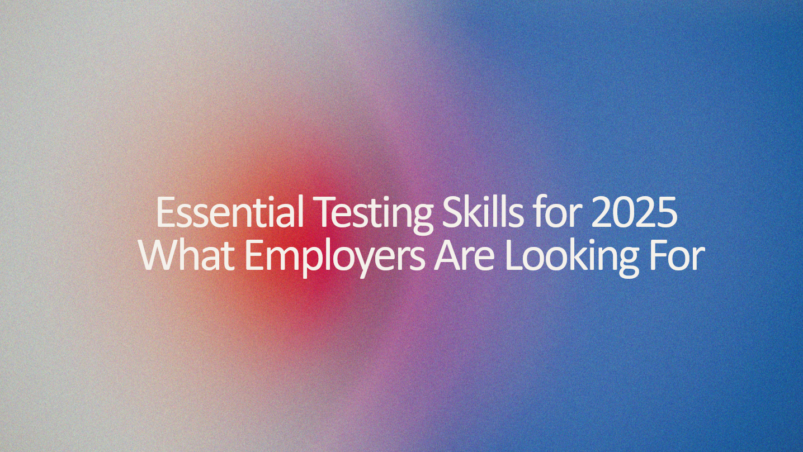

# Python for Test Automation: A Complete Guide

This course provides a comprehensive introduction to **Python programming** and its applications in **test automation**. You’ll start with Python basics—covering variables, data structures, control flow, functions, and OOP—before diving into **test automation frameworks** like **Pytest, Selenium, API testing with Requests, database testing, and BDD with Behave**.

Whether you're a beginner or an experienced tester, this guide will equip you with the skills to automate testing efficiently using Python. 🚀
