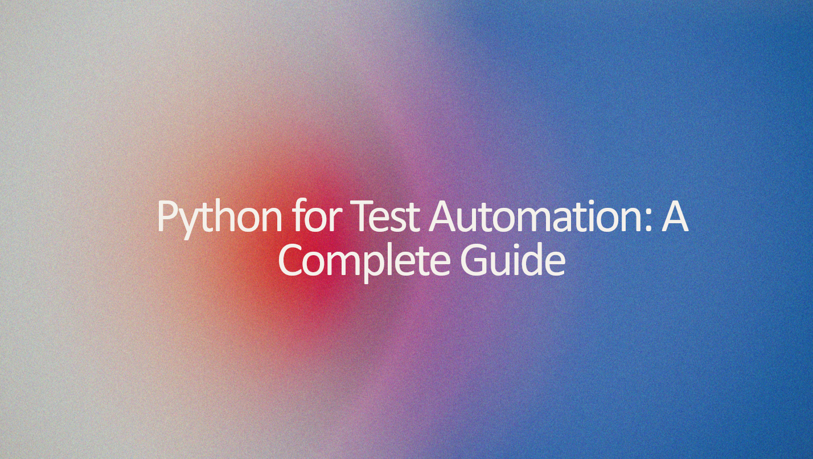

# Python for Test Automation: A Complete Guide

This course provides a comprehensive introduction to **Python programming** and its applications in **test automation**. You’ll start with Python basics—covering variables, data structures, control flow, functions, and OOP—before diving into **test automation frameworks** like **Pytest, Selenium, API testing with Requests, database testing, and BDD with Behave**.

Whether you're a beginner or an experienced tester, this guide will equip you with the skills to automate testing efficiently using Python. 🚀

## 📖 Course Topics  
For a detailed breakdown of the course topics, check out the [Course Overview](docs/course_overview.md).

##	Chapter 1

<table border="1">
  <tr>
    <th>Main Topic</th>
    <th>Sub Topic</th>
  </tr>
  <tr>
    <td rowspan="3"><b><a href="docs/python_overview.md#python-overview">Python Overview</a></b></td>
    <td><a href="docs/python_overview.md#what-is-python">What is Python</a></td>
  </tr>
  <tr>
    <td><a href="docs/python_overview.md#key-features-of-python">Key Features of Python</a></td>
  </tr>
  <tr>
    <td><a href="docs/python_overview.md#where-is-python-used">Where is Python Used?</a></td>
  </tr>
</table>
