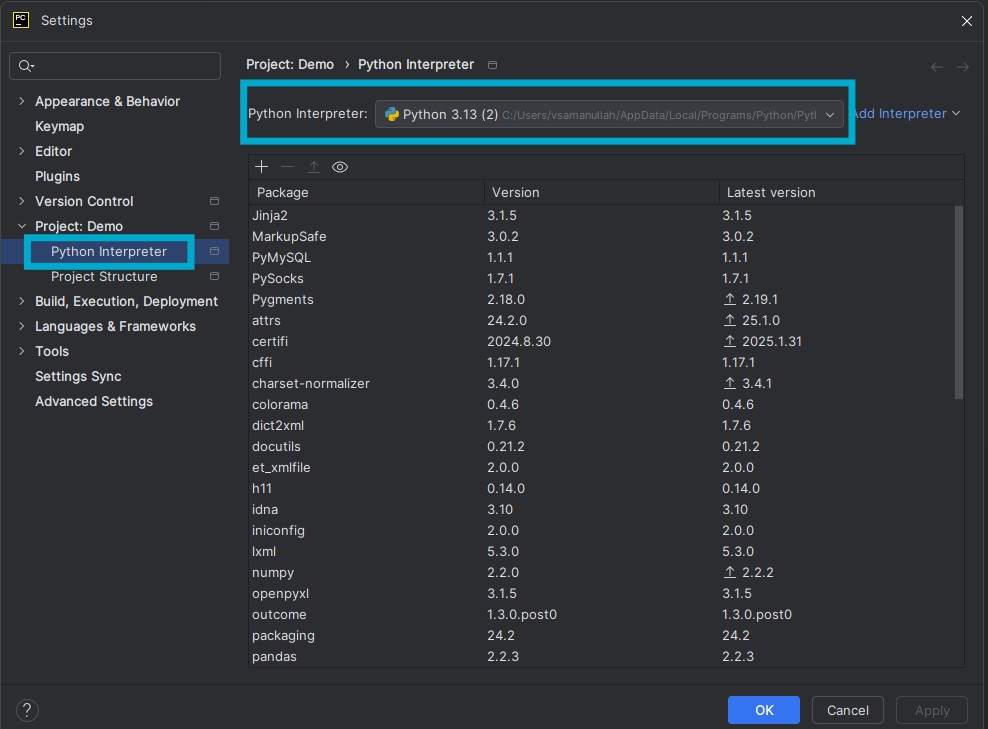

# Installing and Setting Up the PyCharm IDE	
For this series, we will be using PyCharm as our IDE. Follow these steps to install and configure it:

1. Download the latest Community Edition of PyCharm from the official website:
2. https://www.jetbrains.com/pycharm/download/?section=windows
3. Once the download is complete, double-click the .msi (Windows) or appropriate installer file.
4. Follow the on-screen instructions to complete the installation.
5. After installation, open PyCharm and set up the Python interpreter:
    1.  Go to File → Settings → Project → Interpreter.
    2.  Add the path to the installed Python executable.
	
		
	
6. Your PyCharm setup is now complete, and you're ready to start coding!